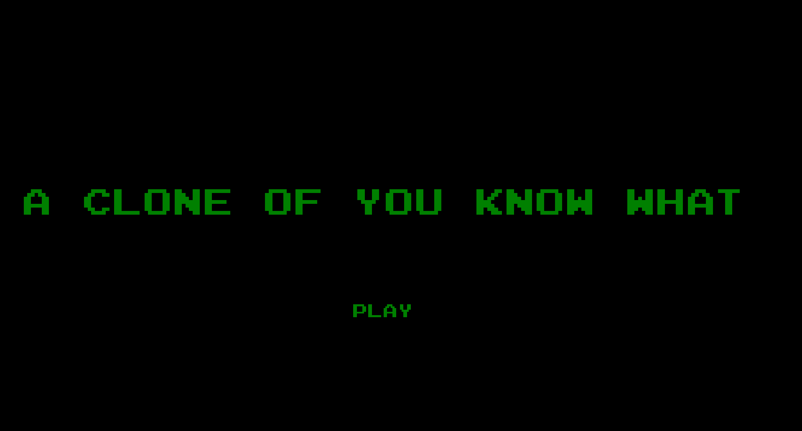
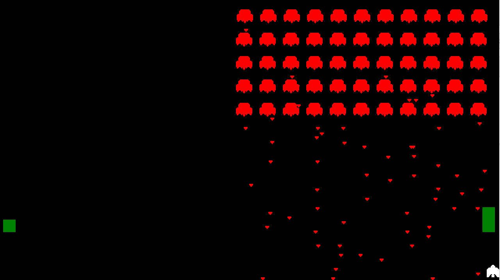
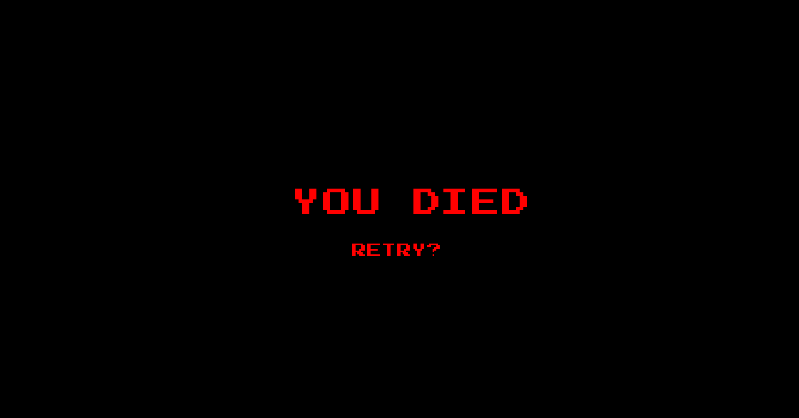

# Space_invaders_clone
A clone of the classic Space Invaders made with SDL2.

## How to install
To use this program you must have installed SDL2, SDL2_image and SDL2_ttf, which can be installed with the following commands.
```
sudo apt-get install libsdl2-dev
sudo apt-get install libsdl2-image-2.0-0-dev
sudo apt-get install libsdl2-ttf-dev
```

### **If you don't have this libraries installed, you can just use the executable provided in this github instead of compiling the code yourself.**

Once the libraries are installed, clone the repository in your preferred directory using git clone.

```
git clone https://github.com/OSCAR-CASALS/Space_invaders_clone.git
```

After that, you just go to the corresponding repository and compile the program with make.

```
cd Space_invaders_clone

make
#Run the recently created executable
./A_copy_of_you_know_what
```

Here is what it should appear when running the game, click start to begin playing.



Image of how the game looks.



Image of the Game Over screen.



Victory screen? Kill all the aliens to find it.

## Reference
Shaun Ross Mitchell."SDL Game Developement", June 2013.

